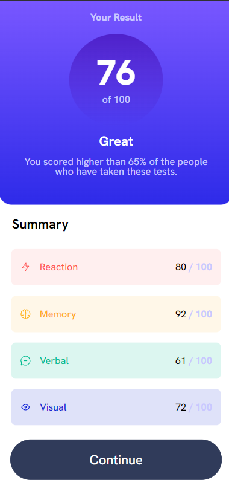
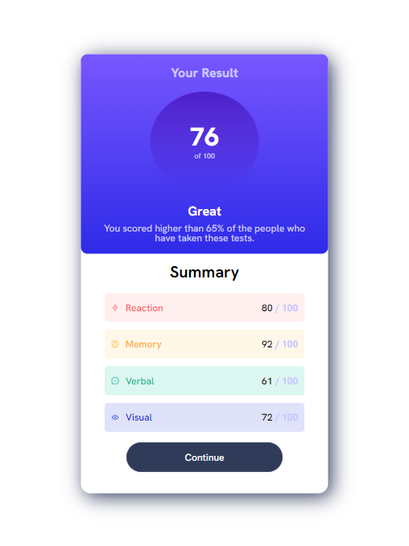
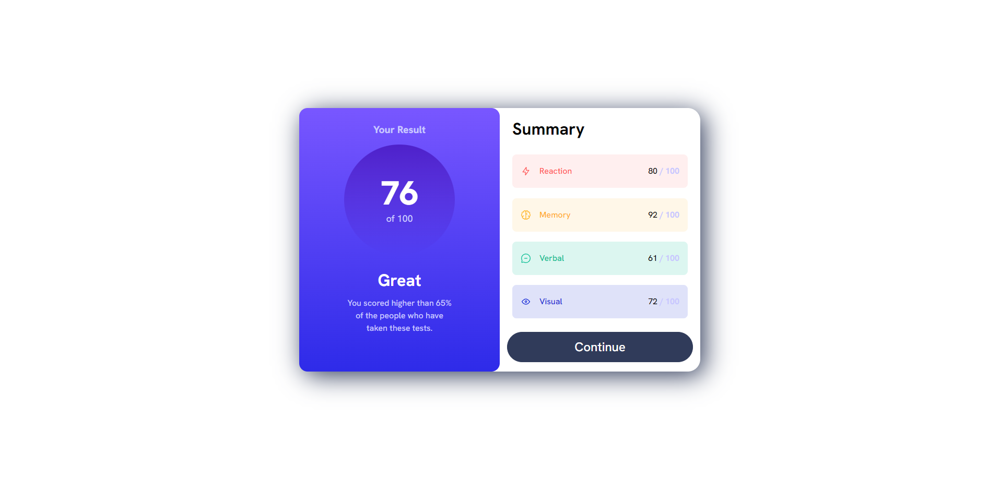

# Frontend Mentor - Results summary component solution

This is a solution to the [Results summary component challenge on Frontend Mentor](https://www.frontendmentor.io/challenges/results-summary-component-CE_K6s0maV). Frontend Mentor challenges help you improve your coding skills by building realistic projects. 

## Table of contents

- [Overview](#overview)
  - [The challenge](#the-challenge)
  - [Screenshot](#screenshot)
  - [Links](#links)
- [My process](#my-process)
  - [Built with](#built-with)
  - [What I learned](#what-i-learned)
  - [Continued development](#continued-development)
  - [Useful resources](#useful-resources)
- [Author](#author)

## Overview

Another great challenge from Frontend Mentor!

### The challenge

Users should be able to:

- View the optimal layout for the interface depending on their device's screen size
- See hover and focus states for all interactive elements on the page

### Screenshot

### Links

- Solution URL: [GitHub](https://github.com/ViniCellist/Frontend-Mentor-Results-Sumary-Component)
- Live Site URL: [Vercel](https://frontend-mentor-results-sumary-component.vercel.app/)

## My process

- Mobile First

### Built with

- Semantic HTML5 markup
- CSS custom properties
- Flexbox
- Mobile-first workflow

### What I learned

Practicing skills...

### Continued development

Working to become a fullstack

### Useful resources

- [HTML5](https://developer.mozilla.org/en-US/docs/Web) - Documentation.
- [CSS3](https://developer.mozilla.org/pt-BR/docs/Web/CSS) - Documentation.
- [Flexbox](https://developer.mozilla.org/pt-BR/docs/Learn/CSS/CSS_layout/Flexbox) - Documentation.

## Author

- GitHub - [Portfolio](https://github.com/ViniCellist)
- Frontend Mentor - [Profile](https://www.frontendmentor.io/profile/ViniCellist)
- Instagram - [Personal](https://www.instagram.com/vinicius_duartesd/)
- LinkedIn - [Professional](https://www.linkedin.com/in/viniciussouzaduarte/)
